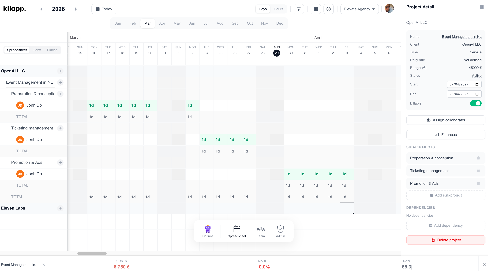

<p align="center">
  
</p>

<p align="center">
  Open-source project management, time tracking, and resource planning platform.<br/>
  Self-hosted, real-time collaborative spreadsheet with AI assistant.
</p>

<p align="center">
  <a href="https://github.com/oxynum/kllapp/actions/workflows/ci.yml"></a>
  <a href="LICENSE"></a>
  
  
  
</p>

<p align="center">
  
</p>

## Features

- **Spreadsheet-based planning** — Canvas-rendered grid with real-time collaboration (Liveblocks)
- **Time tracking** — Log hours/days per user per project per day
- **Budget monitoring** — Visual gauges showing budget consumption per project
- **Forecasting** — Editable project rows for revenue projections (CA prévisionnel)
- **Profitability** — Revenue, costs, margin analysis per project with donut charts
- **Workplace management** — Configure offices, remote work, client sites + floor plan editor
- **Desk booking** — Interactive floor plan with desk reservation system
- **Calendar integration** — Google Calendar / Outlook via iCal with cached event display
- **AI assistant (Corinne)** — Claude-powered chat for querying data and performing actions
- **Availability indicators** — Per-user fill bars in column headers
- **Overallocation alerts** — Visual warnings when users are overbooked
- **Multi-organization** — Support for multiple organizations with role-based access
- **Super-admin dashboard** — Cross-org metrics for platform administrators
- **Internationalization** — French and English

## Quick Start (Docker)

```bash
git clone https://github.com/your-org/kllapp.git
cd kllapp
cp .env.example .env
# Edit .env with your values (at minimum: AUTH_SECRET)
docker compose -f docker-compose.prod.yml up -d
```

Open http://localhost:3000

## Manual Setup

### Prerequisites

- Node.js >= 20
- PostgreSQL >= 16
- Redis (optional, improves caching)

### Installation

```bash
npm ci
docker compose up -d              # Start PostgreSQL + Redis
cp .env.example .env.local        # Configure environment
npm run db:push                   # Create database schema
npm run db:seed                   # Add sample data (optional)
npm run dev                       # Start dev server at http://localhost:3000
```

## Environment Variables

See [`.env.example`](.env.example) for the full list. Key variables:

| Variable | Required | Description |
|----------|----------|-------------|
| `AUTH_SECRET` | Yes | NextAuth signing key (`openssl rand -hex 32`) |
| `AUTH_URL` | Yes (prod) | Your production URL (e.g. `https://app.example.com`) |
| `POSTGRES_URL` | Yes | PostgreSQL connection string |
| `LIVEBLOCKS_SECRET_KEY` | Yes | Liveblocks secret key for real-time collaboration |
| `NEXT_PUBLIC_LIVEBLOCKS_PUBLIC_KEY` | Yes | Liveblocks public key |
| `AUTH_RESEND_KEY` | No | Resend API key (or use SMTP) |
| `SMTP_HOST` | No | SMTP server for emails (alternative to Resend) |
| `ANTHROPIC_API_KEY` | No | Claude API key for AI features |
| `S3_ENDPOINT` | No | S3-compatible storage for file uploads |
| `REDIS_URL` | No | Redis for caching (calendar events, rate limiting) |
| `SUPER_ADMIN_EMAIL` | No | Email to grant super-admin on first deploy |

## Deployment

### Railway

1. Fork this repo
2. Create a new Railway project → Deploy from GitHub
3. Add PostgreSQL and Redis plugins
4. Set environment variables
5. Deploy

### Vercel + Supabase

1. Create a [Supabase](https://supabase.com) project (free tier works)
2. Deploy to [Vercel](https://vercel.com) from GitHub
3. Set `POSTGRES_URL` from Supabase dashboard
4. Run migrations: `npx tsx scripts/migrate-prod.ts`

### Docker (self-hosted VPS)

```bash
git clone https://github.com/your-org/kllapp.git
cd kllapp
cp .env.example .env
# Edit .env
docker compose -f docker-compose.prod.yml up -d
```

### Coolify / Caprover

Use the `docker-compose.prod.yml` as your Docker Compose configuration.

## Stack

- **Framework**: [Next.js 16](https://nextjs.org) (App Router, Server Components)
- **Database**: [PostgreSQL 16](https://postgresql.org) via [Drizzle ORM](https://orm.drizzle.team)
- **Real-time**: [Liveblocks](https://liveblocks.io)
- **Grid**: [@glideapps/glide-data-grid](https://grid.glideapps.com) (canvas-based)
- **AI**: [Anthropic Claude](https://anthropic.com) via `@anthropic-ai/sdk`
- **Styling**: [Tailwind CSS v4](https://tailwindcss.com)
- **Auth**: [NextAuth v5](https://authjs.dev) (Google OAuth + Magic Link)
- **Email**: Resend or any SMTP provider
- **i18n**: [next-intl](https://next-intl.dev)
- **Canvas**: [Konva](https://konvajs.org) (floor plan editor)

## Development

```bash
npm run dev           # Dev server
npm run build         # Production build
npm run lint          # Lint
npm run test          # Run tests
npm run test:coverage # Tests with coverage
npm run db:studio     # Database viewer
```

## Contributing

See [CONTRIBUTING.md](CONTRIBUTING.md).

## Security

See [SECURITY.md](SECURITY.md).

## License

[Sustainable Use License](LICENSE) — Free for self-hosted use. Commercial redistribution requires written permission. See [LICENSE](LICENSE) for details.
